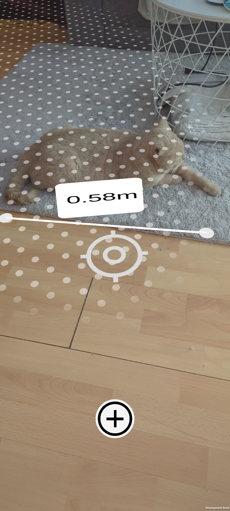

# AR-Measure
This repository contains a measuring app developed for Handheld AR using ARFoundation. Please note that this project is currently a work in progress and may undergo further modifications and improvements.

The project structure has been designed for future flutter export

## Screenshot

## Limitations
Currently, the app only allows placing measuring points on detected planes